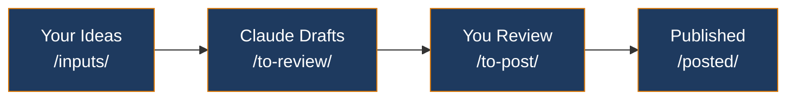

<a id="readme-top"></a>

<div align="center">

<h1>Marketing Multiplier</h1>

<p><strong>A complete marketing system powered by Claude Code.</strong><br>
Generate LinkedIn posts, newsletters, blog articles, and community content<br>in your brand voice, using simple commands.</p>


[Getting Started](#getting-started) &middot; [Commands](#available-commands) &middot; [Pipeline](#the-content-pipeline) &middot; [Examples](#what-it-looks-like-in-practice) &middot; [Tips for Non-Coders](#tips-for-non-coders)

</div>

---

> [!NOTE]
> **You don't need to know how to code to use this.** You need Claude Code installed and the willingness to talk to it. Claude handles the technical work. You bring the ideas, the voice, and the judgment about what's good.

## What This System Does

You talk to Claude Code. Claude knows your brand, your voice, and your content strategy because you've taught it through config files in this repo. When you say `/linkedin-post`, Claude doesn't just generate a generic AI post. It writes in YOUR voice, aligned to YOUR content pillars, following YOUR brand rules.

Here's what a typical week looks like:

1. **Sunday:** You open your terminal, type `/generate-weekly-content`, and Claude drafts LinkedIn posts for the week for each team member
2. **Monday-Friday:** You review the drafts, tweak what needs tweaking (by telling Claude what to change), and post them
3. **When inspiration strikes:** You drop an idea into the `/inputs/` folder and run `/process-idea` to turn it into content across all your channels
4. **When you record something:** Drop the transcript in `/inputs/transcripts/` and run `/process-transcript` to get posts, newsletter content, and blog articles out of it

All content flows through a simple pipeline: **Draft > Review > Approve > Post**. You always have the final say.

<p align="right"><a href="#readme-top">back to top</a></p>

---

## What You Need

<table>
<tr>
<td width="50%">

### Claude Code

Claude Code is Anthropic's command-line tool for working with Claude. It runs in your terminal (the text-based interface on your computer).

If you haven't used a terminal before, don't worry. You'll learn the basics fast, and Claude itself can help you when you get stuck.

</td>
<td width="50%">

### This Repository

Download or clone this repo to your computer:

```
git clone https://github.com/YOUR-ORG/YOUR-REPO.git
cd YOUR-REPO
```

Not sure how? Open Claude Code and ask:
```
> Help me clone a GitHub repository
```

</td>
</tr>
</table>

<details>
<summary><strong>Step-by-step Claude Code installation</strong></summary>

<br>

**1. Install Node.js** (version 18 or newer)
- Go to https://nodejs.org and download the LTS version
- Run the installer, accept all defaults

**2. Install Claude Code**
- Open your terminal:
  - **Mac:** Open the app called "Terminal" (search for it in Spotlight)
  - **Windows:** Install [WSL](https://learn.microsoft.com/en-us/windows/wsl/install) first, then open the "Ubuntu" app
- Type this and press Enter:
  ```
  npm install -g @anthropic-ai/claude-code
  ```

**3. Authenticate**
- In your terminal, type `claude` and press Enter
- Follow the prompts to log in with your Anthropic account
- You'll need an Anthropic API key (get one at https://console.anthropic.com)

**4. Verify it works**
- Type `claude` in your terminal
- If you see a prompt where you can type to Claude, you're good

</details>

<p align="right"><a href="#readme-top">back to top</a></p>

---

## Getting Started

### Step 1: Open the system in Claude Code

In your terminal, navigate to this folder and start Claude Code:

```
cd /path/to/this/folder
claude
```

You'll see a prompt where you can type to Claude. Claude can now see all the files in this system and understands how it works because of the `CLAUDE.md` file.

### Step 2: Customize it for your brand

The system comes with placeholder text everywhere it needs your specifics. Tell Claude:

```
> Help me set up this marketing system for my company.
  My company is called [name] and we [what you do].
```

Claude will walk you through filling in:
- Your brand voice and tone
- Your content pillars (the themes you write about)
- Your team members' voice profiles
- Your goals and key links

> [!TIP]
> See `SETUP.md` for the full configuration checklist. You can also just ask Claude: "Walk me through the setup checklist" and it will guide you through every step.

### Step 3: Start creating content

Once your brand is configured, try your first command:

```
> /linkedin-post
```

Claude will ask you what you want to write about, then generate a post in your brand voice.

<p align="right"><a href="#readme-top">back to top</a></p>

---

## The Content Pipeline

Every piece of content flows through the same stages:



> [!IMPORTANT]
> **You always review before anything goes out.** Claude drafts, you decide. Nothing is published automatically unless you set it up that way.

### The folders

| Folder | What's in it | What you do with it |
|--------|-------------|-------------------|
| `marketing/inputs/` | Your raw material: ideas, transcripts, brainstorming docs | Drop files here whenever you have something |
| `marketing/to-review/` | Claude's drafts, organized by channel | Read, give feedback, ask for revisions |
| `marketing/to-post/` | Approved content ready to publish | Copy-paste to LinkedIn, send newsletter, etc. |
| `marketing/posted/` | Archive of everything published | Reference for what's worked |

<p align="right"><a href="#readme-top">back to top</a></p>

---

## Available Commands

These are the slash commands you can use in Claude Code. Type them at the prompt.

<table>
<tr><td>

### Create Content

| Command | What it does |
|---------|-------------|
| `/generate-weekly-content` | Draft a full week of LinkedIn posts for all team members |
| `/linkedin-post` | Create a single LinkedIn post |
| `/draft-newsletter` | Draft your weekly newsletter |
| `/blog-post` | Write a blog article |
| `/process-idea` | Turn a rough idea into polished multi-channel content |

</td><td>

### Repurpose Content

| Command | What it does |
|---------|-------------|
| `/process-transcript` | Turn a transcript into posts, articles, and more |
| `/repurpose-session` | Full session recording into a complete content package |

### Manage Content

| Command | What it does |
|---------|-------------|
| `/approve-content` | Move reviewed content to to-post |
| `/publish-blog` | Push a blog post to your website |
| `/log-post` | Log a published post to tracking |

</td></tr>
</table>

<details>
<summary><strong>Planning and analysis commands</strong></summary>

<br>

| Command | What it does |
|---------|-------------|
| `/campaign-brief` | Plan a new marketing campaign |
| `/dm-outreach` | Generate personalized outreach messages |
| `/analyze-week` | Review your content performance and get recommendations |
| `/content-review` | Get Claude's feedback on a piece of content |

</details>

<p align="right"><a href="#readme-top">back to top</a></p>

---

## What It Looks Like in Practice

Here are real examples of how you'd interact with the system.

<details>
<summary><strong>Example 1: Generating a LinkedIn post</strong></summary>

<br>

```
You:  /linkedin-post

Claude: Who is this post for?
        1. [Founder 1]
        2. [Founder 2]
        3. [Founder 3]
        4. Company page

You:  1

Claude: What's the topic or idea for this post?

You:  I had a great conversation today with a client who finally
      got their team using AI daily after months of resistance.
      The breakthrough was making it about small wins, not big transformation.

Claude: [Generates a full LinkedIn post in Founder 1's voice,
        saves it to /marketing/to-review/linkedin/founder-1/]

You:  I like it but the opening is too generic. Make it start with
      the actual moment the client told me about the breakthrough.

Claude: [Revises the post and saves the updated version]

You:  Perfect. Move it to to-post.

Claude: [Moves the file to /marketing/to-post/linkedin/founder-1/]
```

</details>

<details>
<summary><strong>Example 2: Turning a meeting transcript into content</strong></summary>

<br>

```
You:  /process-transcript

Claude: I'll look for transcripts in /marketing/inputs/transcripts/.
        I found: 2026-02-20_team-strategy-call.txt
        Should I process this one?

You:  Yes

Claude: [Reads the transcript, identifies key themes, and generates:]
        - 3 LinkedIn posts (one per founder voice)
        - 1 newsletter section
        - 1 blog post outline
        - 2 community discussion prompts

        All saved to /marketing/to-review/ in their respective folders.

        Here's a summary of what I created...

You:  The blog outline looks great. Flesh it out into a full post.

Claude: [Writes the full blog post and saves it]
```

</details>

<details>
<summary><strong>Example 3: Weekly content generation</strong></summary>

<br>

```
You:  /generate-weekly-content This week let's focus on
      practical AI tips, we just launched a new feature
      and I want to show people how to use it

Claude: [Generates 3-5 LinkedIn posts per founder for the week,
        each aligned to your content pillars but focused on the
        practical AI tips theme. Saves everything to /to-review/]

        Here's what I created for this week:

        [Founder 1] - 4 posts
        - Monday: [title]
        - Tuesday: [title]
        - Thursday: [title]
        - Friday: [title]

        [Founder 2] - 3 posts
        ...
```

</details>

<p align="right"><a href="#readme-top">back to top</a></p>

---

## The Marketing UI (Optional)

This system includes a web-based interface you can run locally. It gives you a visual dashboard for chatting with Claude and seeing your content pipeline at a glance.

<table>
<tr>
<td width="50%">

**To start it, ask Claude:**
```
> Help me start the Marketing UI
```

Or manually:
```bash
cd ui && npm install && npm run dev
```

Then open http://localhost:4000

</td>
<td width="50%">

**The UI includes:**
- **Chat tab** - Talk to Claude with brand context loaded
- **Pipeline tab** - See content across all stages
- **Calendar tab** - Plan and track what's going out when
- **Newsletter tab** - Newsletter-specific workflow

</td>
</tr>
</table>

> [!TIP]
> The UI is optional. Everything it does, you can also do directly in Claude Code through the terminal.

<p align="right"><a href="#readme-top">back to top</a></p>

---

## Making It Yours

This system is designed to grow with you. Here's how it evolves:

```mermaid
gantt
    title Your Journey
    dateFormat X
    axisFormat %s

    section Getting Started
    Set up brand basics           :a1, 0, 1
    First content batch           :a2, 1, 2

    section Finding Your Voice
    Refine voice through feedback :a3, 2, 5
    Update founder skills         :a4, 3, 5

    section Expanding
    New pillars and commands      :a5, 5, 8
    Blog and newsletter automation:a6, 6, 8
    Add team members              :a7, 7, 8
```



**Week 1: Get it running**
- Fill in your brand basics (company name, what you do, your voice)
- Generate your first batch of content
- Get comfortable with the review-and-revise loop

**Weeks 2-4: Refine your voice**
- The first drafts won't be perfect. That's expected
- Every time you give Claude feedback ("too formal," "I'd never say it that way," "more concrete examples"), it gets better within that session
- Update your founder voice skills (`.claude/skills/`) with what you learn

**Month 2+: Expand and automate**
- Add new content pillars as your strategy evolves
- Set up blog publishing to push directly to your website
- Configure newsletter sending via Gmail API
- Add new team members by duplicating the founder skill template
- Create custom commands for workflows specific to your business

### Let Claude improve the system itself

One of the most powerful things about this setup: **you can ask Claude to improve the system itself.**

```
> The LinkedIn posts are too long. Update the linkedin-post command
  to aim for 150 words max.

> Add a new content pillar about customer success stories.
  Update the brand skill and content pillars doc.

> Create a new command that generates a LinkedIn carousel outline
  from a blog post.
```

Claude can edit its own config files, create new commands, and extend the system. You describe what you want, Claude builds it.

<p align="right"><a href="#readme-top">back to top</a></p>

---

## How It's Organized

```
your-marketing-repo/
├── CLAUDE.md                    # The brain: your brand, pipeline, and rules
├── SETUP.md                     # Step-by-step setup checklist
├── README.md                    # This file
│
├── .claude/
│   ├── commands/                # Slash commands (the /things you type)
│   └── skills/                  # Brand voice, visual brand, founder profiles
│
├── marketing/
│   ├── inputs/                  # Your raw material goes here
│   ├── to-review/               # Claude's drafts land here
│   ├── to-post/                 # Approved content ready to publish
│   ├── posted/                  # Archive of published content
│   ├── calendar/                # Content calendar and tracking
│   ├── templates/               # Reusable templates (newsletter HTML, etc.)
│   └── campaigns/               # Campaign planning
│
├── scripts/                     # Utility scripts (newsletter, blog publishing)
├── ui/                          # Optional web interface
└── docs/                        # Strategy docs and reference material
```

> [!NOTE]
> The most important file is `CLAUDE.md`. It's the instruction manual that teaches Claude about your brand, your pipeline, your workflow, and your rules. When you want to change how the system works, that's usually where you start.

<p align="right"><a href="#readme-top">back to top</a></p>

---

## Tips for Non-Coders

**You don't need to understand the code.** But here are some things that help:

<table>
<tr>
<td width="50%">

**1. Talk to Claude like a person**<br>
"Make this more casual" works better than trying to use technical language you're not comfortable with.

**2. Ask Claude to explain things**<br>
If you see a file you don't understand, ask: "What does this file do and should I change anything in it?"

**3. Don't be afraid to try things**<br>
Git means you can always undo. If something breaks, tell Claude: "Something went wrong, help me fix it."

**4. The terminal is just a text conversation**<br>
You type, the computer responds. Claude Code makes it a conversation with an AI that can also read and edit files.

</td>
<td width="50%">

**5. Start simple**<br>
Use `/linkedin-post` a few times before trying the full weekly workflow. Get comfortable with the rhythm.

**6. Your feedback makes it better**<br>
Every time you say "that doesn't sound like me" and explain why, you're training the system. Update your voice profiles with what you learn.

**7. Ask Claude to do the technical parts**<br>
Need to set up the newsletter sender? Tell Claude: "Help me set up the newsletter sending script." It will walk you through it step by step.

</td>
</tr>
</table>

<p align="right"><a href="#readme-top">back to top</a></p>

---

## Getting Help

Inside Claude Code, you can always ask:

```
> What commands are available?
> How does the content pipeline work?
> Show me what's ready to post this week
> Help me set up [anything]
```

Claude has full context on this system. It's read the CLAUDE.md, the commands, the skills, and all the docs. Ask it anything about how things work.

> [!TIP]
> For issues with Claude Code itself, see the [Claude Code documentation](https://docs.anthropic.com/en/docs/claude-code).

---

<div align="center">

*Built with Claude Code. The system practices what it preaches: using AI to multiply what you're capable of.*

</div>
